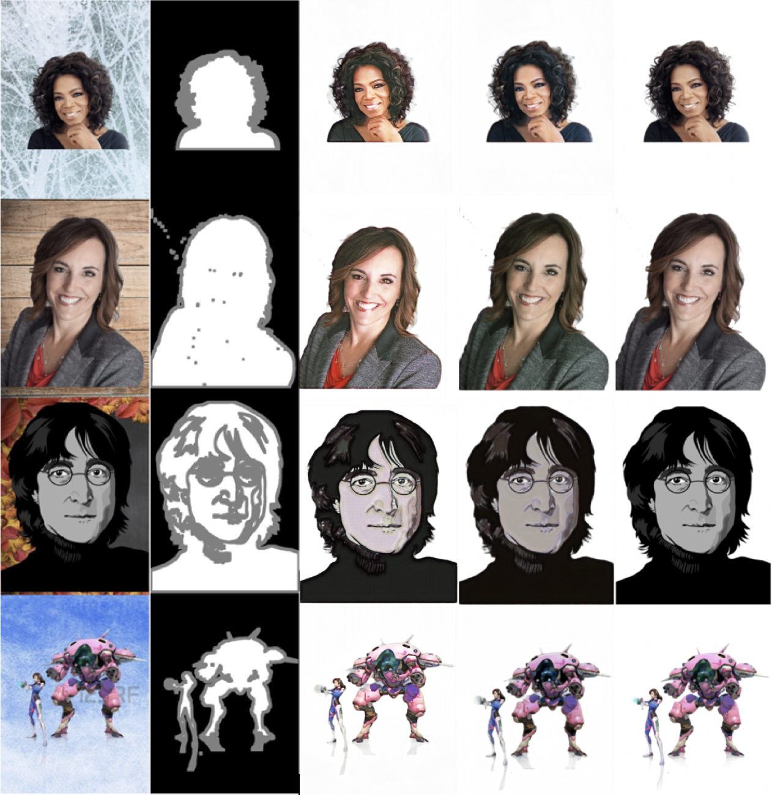

# Background removal using U-net, GAN and image matting
This project represents the final project for The INF8225: machine learning course at polytechnique Montreal.

Contributors:

- Amine El Hattami
- Étienne Pierre-Doray
- Youri Barsalou

# Overview
In this project we tackle on the problem of background removal through image matting. It consists of predicting the foreground of an image or a video frame. However, unlike basic background / foreground segmentation, matting takes into account the transparency of an object. Indeed, object seen on images are not always present at full opacity. Think for instance of a tinted glass box. Ideal image segmentation would give a mask telling which pixel belongs to the box and which to the rest of the image. However, ideal image matting would return a transparency mask for the box’s coordinates, such that applying a mask to the box’s original image and then onto a completely different background would allow us to see this new background through the box. The following are some of the results of our model.

From left to right:  the input image, the associated input trimap, resulting extracted foreground w/o GAN, resulting extracted foreground and the ground truth

## Software requirements

The project was written using **Python 3.6** with the following packages:

- Pillow
- tensorflow or tensorflow-gpu 
- numpy
- google\_images\_download
- opencv-python

We also provide a requirement file to install all needed packages.

For an enviroment without GPU:

`pip3 install -r requirements.txt`

For an enviroment with GPU:

`pip3 install -r requirements-gpu.txt`

The download script uses the chromediver which is available by installing the chrome web browser. It can also be installed stand alone. Checkout the following link for more info [chromedriver](https://sites.google.com/a/chromium.org/chromedriver/)

## Dataset

This project uses a custom dataset generated by a script. The script crawl the web to retreive foreground and background images with specific filters. Note that the output of the script was manually filtered. Refer to the Experiment section in the project article for more details about the dataset generation.

The dataset generation is done in two steps:

- Download the foreground and background images 

 `python3 scripts/download.py`

- Combine the the foreground and back images:
 
 `python3 scripts/combine.py`

This will create a new folder in `data` in the `scripts` directory in wich the dataset is stored.

## Training

Once the dataset is generated, the model can be trained using the following:

`python3 train.py scripts/data`

The training script will save a checkpoint in the `log` directory after each 100 batches. it also saves a checkeck point when an exception is thrown and script terminates.

## Evaluate
In order to try our model, we included a snapshot of our trained model (in the `log` directory). That can be used as follow:

`python3 eval.py <input_img_path> <trimap_img_path> <output_img_path> --checkpoint -1`
